<a href="https://abagames.github.io/crisp-game-lib/?survivor">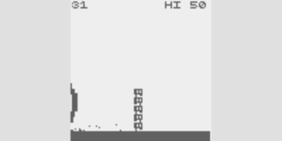</a><a href="https://abagames.github.io/crisp-game-lib/?chargebeam">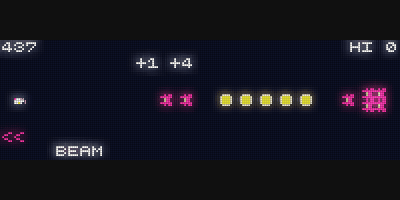</a><a href="https://abagames.github.io/crisp-game-lib/?pillars3d">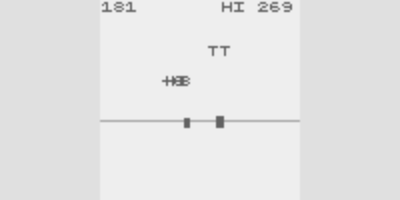</a><a href="https://abagames.github.io/crisp-game-lib/?slalom">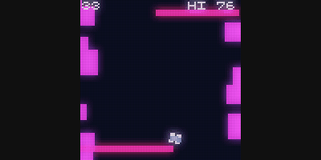</a>

<h1 align="center">crisp-game-lib</h1>

<a href="https://abagames.github.io/crisp-game-lib/?doshin">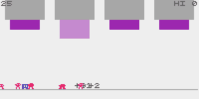</a><a href="https://abagames.github.io/crisp-game-lib/?cardq">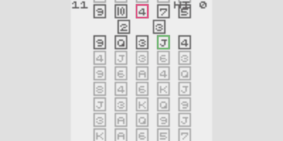</a><a href="https://abagames.github.io/crisp-game-lib/?earock">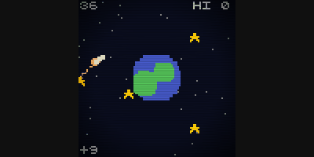</a><a href="https://abagames.github.io/crisp-game-lib/?shiny">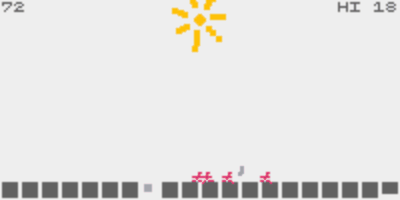</a>

`crisp-game-lib` is a JavaScript library for creating browser games quickly and easily. I developed [50 minigames in 2014](http://www.asahi-net.or.jp/~cs8k-cyu/blog/2014/12/12/games-in-2014/), as well as the Haxe library [mgl](https://github.com/abagames/mgl) and the CoffeeScript library [mgl.coffee](https://github.com/abagames/mgl.coffee) to make them. After that I continued to work on minigames and libraries. Using this experience, `crisp-game-lib` was created as a library with the minimum functionality necessary to create classic arcade-like minigames.

The `crisp-game-lib` itself is well dogfooded, and I have already created [more than 50 games](https://github.com/abagames/crisp-game-lib#demo-click-the-image-to-play) in a short time using this library. By simply writing a single JavaScript file with the game `title`, `description`, and an `update` function that is called 60 times per second, you can create a browser game that runs on PC and mobile devices. The functions necessary for the mini-game are provided in the form of [functions for drawing](https://github.com/abagames/crisp-game-lib#drawing-demo) boxes, lines, arcs, text, characters, [a collision detection function](https://github.com/abagames/crisp-game-lib#collision-demo) integrated with these drawing functions, [an input acquisition function](https://github.com/abagames/crisp-game-lib#input-demo) that supports both mouse and touch panel, and [a sound effect function](https://github.com/abagames/crisp-game-lib#sound-demo) that allows the developer to simply select the name of the sound to be played. In addition, there are functions to make the game juicy, such as background music that is automatically generated by setting `isPlayingBgm` to true as [an option](https://github.com/abagames/crisp-game-lib#options), replay function that is enabled by setting `isReplayEnabled` to true, the ability to change the appearance of the game to retro CRT style or dot picture style by simply setting `theme`, and pixel arts that can be easily defined with the `characters` array.

It also has [type definitions in TypeScript](https://github.com/abagames/crisp-game-lib/blob/master/docs/bundle.d.ts), so you can fully benefit from IntelliSense on [VSCode](https://code.visualstudio.com/). Please refer to [the sample code](https://github.com/abagames/crisp-game-lib#sample-code) and [reference](https://github.com/abagames/crisp-game-lib#reference) below for more details on what kind of code you should write.

See also [the article about crisp-game-lib](https://terrysfreegameoftheweek.com/kento-chos-crisp-game-lib-games/) written by [Terry Cavanagh](https://twitter.com/terrycavanagh), known as the developer of [Super Hexagon](https://store.steampowered.com/app/221640/Super_Hexagon/) and [VVVVVV](https://store.steampowered.com/app/70300/VVVVVV/). A list of the browser games I've made can be found on [my web page](https://abagames.github.io/games-web-pages/browser.html). By looking at the gif animations of each game, you can easily understand its rules.

## Demo (Click the image to play)

<a href="https://abagames.github.io/crisp-game-lib/?cywall">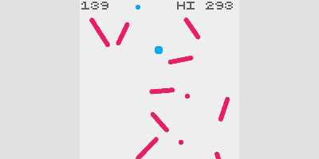</a><a href="https://abagames.github.io/crisp-game-lib/?lland">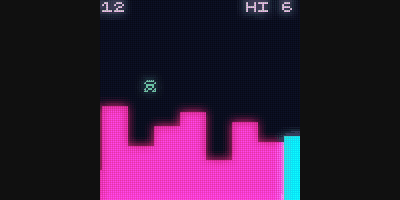</a><a href="https://abagames.github.io/crisp-game-lib/?bamboo">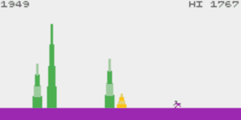</a><a href="https://abagames.github.io/crisp-game-lib/?pileup">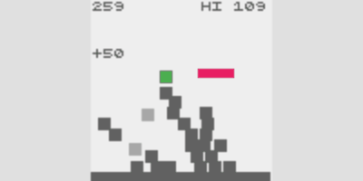</a>

<a href="https://abagames.github.io/crisp-game-lib/?grenadier">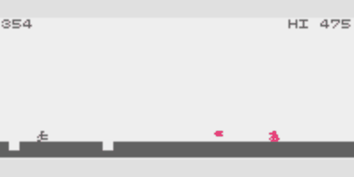</a><a href="https://abagames.github.io/crisp-game-lib/?catep">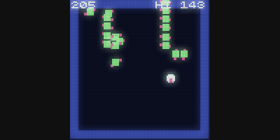</a><a href="https://abagames.github.io/crisp-game-lib/?zoneb">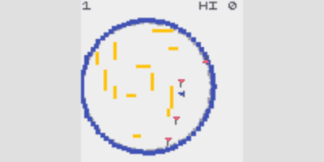</a><a href="https://abagames.github.io/crisp-game-lib/?flipbomb"></a>

<a href="https://abagames.github.io/crisp-game-lib/?pressm">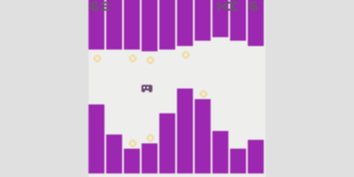</a><a href="https://abagames.github.io/crisp-game-lib/?twinp"></a><a href="https://abagames.github.io/crisp-game-lib/?descents">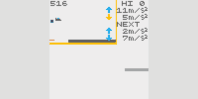</a><a href="https://abagames.github.io/crisp-game-lib/?arcfire">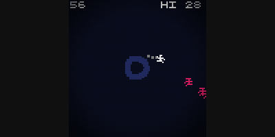</a>

Other games are listed on [my browser games page](https://abagames.github.io/games-web-pages/browser.html).

## Sample code

[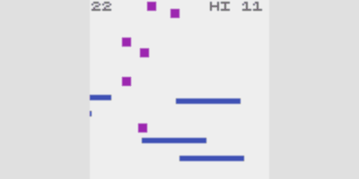](https://abagames.github.io/crisp-game-lib/?refbals)

```javascript
// Title of the game
title = "REFBALS";

// Description is displayed on the title screen
description = `
[Hold] Accel
`;

// User defined text characters
characters = [];

// Game options
options = {
  isPlayingBgm: true,
  isReplayEnabled: true,
};

let balls;
let walls;

// 'update()' is called per frame (1 frame = 1/60 second)
function update() {
  // 'ticks' counts the number of frames from the start of the game
  if (!ticks) {
    // Initialize variables at the first frame (ticks === 0)
    balls = [];
    // 'vec()' creates a 2d vector instance
    walls = times(5, (i) => vec(i * -29, -9));
  }
  if (!(ticks % 99)) {
    // 'rnd()' returns a random number
    balls.push({ p: vec(rnd(50), 0), v: 0 });
  }
  // 'color()' sets a drawing color
  color("blue");
  walls.map((w) => {
    // 'input.isPressed' returns true if
    // a mouse button, a key or a touch screen is pressed
    w.x -= input.isPressed ? 2 : 1;
    // 'box()' draws a rectangle
    box(w, 36, 3);
    if (w.x < -19) {
      w.x += rnd(130, 150);
      w.y = rnd(50, 90);
    }
  });
  color("purple");
  balls.map((b) => {
    if ((b.p.y += b.v += 0.03) > 99) {
      // 'play()' plays a sound effect
      play("explosion");
      // A game is over when 'end()' is called
      end();
    }
    // 'box()' returns a collision status
    if (box(b.p, 5).isColliding.rect.blue) {
      play("select");
      // 'score' represents the score of the game
      score++;
      b.p.y += (b.v *= -1) * 2;
    }
  });
}
```

The minified code is 274 letters long.

```javascript
tc || ((e = []), (i = tms(5, (e) => vec(-29 * e, -9)))),
  tc % 99 || e.push({ p: vec(rnd(50), 0), v: 0 }),
  clr(bl),
  i.map((e) => {
    (e.x -= inp.ip ? 2 : 1),
      box(e, 36, 3),
      e.x < -19 && ((e.x += rnd(130, 150)), (e.y = rnd(50, 90)));
  }),
  clr(pr),
  e.map((e) => {
    (e.p.y += e.v += 0.03) > 99 && (ply(ex), end()),
      box(e.p, 5).bl && (ply(sl), sc++, (e.p.y += 2 * (e.v *= -1)));
  });
```

## More sample codes

Sample code for each game is `main.js` in each directory in the [docs directory](https://github.com/abagames/crisp-game-lib/tree/master/docs).

## Write your own game

1. Clone or [download](https://github.com/abagames/crisp-game-lib/archive/refs/heads/master.zip) this repository.

1. `npm install`

1. Copy the `docs/_template` directory and rename it to `[your own game name]`.

1. Open `docs/[your own game name]/main.js` with the editor ([VSCode](https://code.visualstudio.com/) is recommended) and write your own game code.

1. `npm run watch_games`

1. Open the URL `http://localhost:4000?[your own game name]` with a browser. The page is live-reloaded when the code is rewritten.

## Reference

### Drawing ([DEMO](https://abagames.github.io/crisp-game-lib/?ref_drawing))

[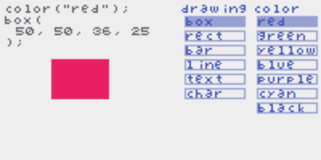](https://abagames.github.io/crisp-game-lib/?ref_drawing)

```javascript
function update() {
  // Set the drawing color.
  // color(colorName : "transparent" | "white" |
  // "black" | "red" | "green" | "blue" |
  // "yellow" | "purple" | "cyan" |
  // "light_black" | "light_red" | "light_green" | "light_blue" |
  // "light_yellow" | "light_purple" | "light_cyan");
  color("red");
  // Draw the box.
  // box(x, y, width, height?);
  // box(pos, size);
  box(20, 20, 15, 20);
  // Draw the rectangle.
  // rect(x, y, width, height?);
  // rect(pos, size);
  rect(70, 20, 20, 25);
  // Draw the bar.
  // bar(x, y, length, thickness, rotate, centerPosRatio?);
  // bar(pos, length, thickness, rotate, centerPosRatio?);
  bar(20, 70, 18, 5, 0.7, 0.5);
  // Draw the line.
  // line(x1, y1, x2, y2, thickness);
  // line(p1, p2, thickness);
  line(70, 70, 90, 80);
  // Draw the arc.
  // arc(x, y, radius, thickness?, angleFrom?, angleTo?);
  // arc(pos, radius, thickness?, angleFrom?, angleTo?);
  arc(30, 60, 20, 5, 0.1, 1.5);
  // Draw the text.
  // text(string, x, y, options?);
  // text(string, p, options?);
  text("a", 10, 20);
  // Draw the user defined character.
  // char(string, x, y, options?);
  // char(string, p, options?);
  char("a", 30, 40);
}
```

### Collision ([DEMO](https://abagames.github.io/crisp-game-lib/?ref_collision))

[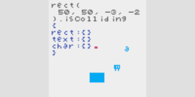](https://abagames.github.io/crisp-game-lib/?ref_collision)

```javascript
function update() {
  color("purple");
  box(50, 50, 20, 10);
  color("green");
  // Check if the drawn figure collides a rect/text/char.
  // [Drawing function].isColliding => {
  //   rect.[color]: boolean;
  //   text.[char]: boolean;
  //   char.[char]: boolean;
  // }
  // If the drawing box collides the purple rect...
  if (box(input.pos, 5, 5).isColliding.rect.purple) {
    end();
  }
}
```

### Input ([DEMO](https://abagames.github.io/crisp-game-lib/?ref_input))

```javascript
function update() {
  // 'input' variable returns the input status.
  // input => {
  //   pos: Vector;
  //   isPressed: boolean;
  //   isJustPressed: boolean;
  //   isJustReleased: boolean;
  // }
  color(input.isPressed ? "red" : "blue");
  box(input.pos, 10, 10);
}
```

### Sound ([DEMO](https://abagames.github.io/crisp-game-lib/?ref_sound))

```javascript
function update() {
  // Plays a sound effect.
  // play(type: "coin" | "laser" | "explosion" | "powerUp" |
  // "hit" | "jump" | "select" | "lucky");
  play("coin");
}
```

### Other variables and functions

```typescript
// Game ticks (60 ticks = 1 second)
let ticks: number;
// difficulty (Starts from 1, increments by a minute)
let difficulty: number;
// score
let score: number;

// Add score
function addScore(value: number);
function addScore(value: number, x: number, y: number);
function addScore(value: number, pos: VectorLike);

// Add particles
function particle(
  x: number,
  y: number,
  count?: number,
  speed?: number,
  angle?: number,
  angleWidth?: number
);
function particle(
  pos: VectorLike,
  count?: number,
  speed?: number,
  angle?: number,
  angleWidth?: number
);

// End game (Game Over)
function end(): void;

// Return random number
function rnd(lowOrHigh?: number, high?: number);
// Return random integer
function rndi(lowOrHigh?: number, high?: number);
// Return plus of minus random number
function rnds(lowOrHigh?: number, high?: number);

// Return Vector instance
function vec(x?: number | VectorLike, y?: number): Vector;

class Vector {
  x: number;
  y: number;
  constructor(x?: number | VectorLike, y?: number);
  set(x?: number | VectorLike, y?: number): this;
  add(x?: number | VectorLike, y?: number): this;
  sub(x?: number | VectorLike, y?: number): this;
  mul(v: number): this;
  div(v: number): this;
  clamp(xLow: number, xHigh: number, yLow: number, yHigh: number): this;
  wrap(xLow: number, xHigh: number, yLow: number, yHigh: number): this;
  addWithAngle(angle: number, length: number): this;
  swapXy(): this;
  normalize(): this;
  rotate(angle: number): this;
  angleTo(x?: number | VectorLike, y?: number): number;
  distanceTo(x?: number | VectorLike, y?: number): number;
  isInRect(x: number, y: number, width: number, height: number): boolean;
  equals(other: VectorLike): boolean;
  floor(): this;
  round(): this;
  ceil(): this;
  length: number;
  angle: number;
}

interface VectorLike {
  x: number;
  y: number;
}

const PI: number;
function abs(v: number): number;
function sin(v: number): number;
function cos(v: number): number;
function atan2(y: number, x: number): number;
function pow(b: number, e: number): number;
function sqrt(v: number): number;
function floor(v: number): number;
function round(v: number): number;
function ceil(v: number): number;
function clamp(v: number, low?: number, high?: number): number;
function wrap(v: number, low: number, high: number): number;
function range(v: number): number[];
function times<T>(count: number, func: (index: number) => T): T[];
function remove<T>(array: T[], func: (v: T, index?: number) => any): T[];
function addWithCharCode(char: string, offset: number): string;
```

### Options

```javascript
// Title of the game.
title = "CHARGE BEAM";

// Description is shown on a title screen.
description = `
[Tap]     Shot
[Hold]    Charge
[Release] Fire
`;

// Define pixel arts of characters.
// Each letter represents a pixel color.
// (l: black, r: red, g: green, b: blue
//  y: yellow, p: purple, c: cyan
//  L: light_black, R: light_red, G: light_green, B: light_blue
//  Y: light_yellow, P: light_purple, C: light_cyan)
// Characters are assigned from 'a'.
// 'char("a", 0, 0);' shows the character
// defined by the first element of the array.
characters = [
  `
rllbb
lllccb
llyl b
`,
  `
  r rr
rrrrrr
  grr
  grr
rrrrrr
  r rr
`,
  `
 LLLL
LyyyyL
LyyyyL
LyyyyL
LyyyyL
 LLLL
`,
  `
   bbb
  bccb
bbllcb
bcllcb
  bccb
   bbb
`,
  `
l llll
l llll
`,
];

// Set the options.
// options = {
//   viewSize?: { x: number; y: number }; // Set the screen size.
//   theme?: "simple" | "pixel" | "shape" | "shapeDark" | "crt" | "dark";
//    // Select the appearance theme.
//   isPlayingBgm?: boolean; // Play a BGM.
//   isReplayEnabled?: boolean; // Enable a replay.
//   seed?: number; // Set the random seed for sounds.
//
//   isCapturing?: boolean; // Capture a screen by pressing 'c'.
//   isShowingScore?: boolean; // Show a score and a hi-score.
//   isMinifying?: boolean; // Show a minified code to the console.
// };
options = {
  viewSize: { x: 200, y: 60 },
  theme: "pixel",
  isPlayingBgm: true,
  isReplayEnabled: true,
  seed: 1,
};
```

### Shorthands

A minified source code uses shorthands for functions and variables.

```javascript
// color -> clr
//  "red" -> rd, "blue" -> bl, "green" -> gr, ...
clr(bl);
// play -> ply
//  "coin" -> ci, "laser" -> ls, "explosion" -> ex, ...
ply(ex);
// input -> inp
//  pos -> p, isPressed -> ip, isJustPressed -> ijp, isJustReleased -> ijr
e.x -= inp.ip ? 2 : 1;
// .isColliding.rect.blue -> .bl
box(e.p, 5, 5).bl;
// times -> tms, remove -> rmv
i = tms(5, (e) => vec(-29 * e, -9));
// ticks -> tc, difficulty -> df, score -> sc
tc % 99 || sc += df;
```
