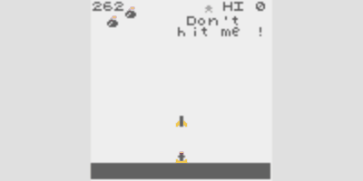

# crisp-game-lib

Develop one game within one hour.

## Related pages

- [Terry Cavanagh](https://twitter.com/terrycavanagh) has written [a great article](https://terrysfreegameoftheweek.com/kento-chos-crisp-game-lib-games/) about this library.

- The browser games I have made are listed on [this page](https://abagames.github.io/games-web-pages/browser.html). (including games made without using this library)

## Sample game (Click the image to play)

[](https://abagames.github.io/crisp-game-lib/?refbals)

```javascript
// Title of the game
title = "REFBALS";

// Description is displayed on the title screen
description = `
[Hold] Accel
`;

// User defined text characters
characters = [];

// Game options
options = {
  isPlayingBgm: true,
  isReplayEnabled: true,
};

let balls;
let walls;

// 'update()' is called per frame (1 frame = 1/60 second)
function update() {
  // 'ticks' counts the number of frames from the start of the game
  if (!ticks) {
    // Initialize variables at the first frame (ticks === 0)
    balls = [];
    // 'vec()' creates a 2d vector instance
    walls = times(5, (i) => vec(i * -29, -9));
  }
  if (!(ticks % 99)) {
    // 'rnd()' returns a random number
    balls.push({ p: vec(rnd(50), 0), v: 0 });
  }
  // 'color()' sets a drawing color
  color("blue");
  walls.map((w) => {
    // 'input.isPressed' returns true if
    // a mouse button, a key or a touch screen is pressed
    w.x -= input.isPressed ? 2 : 1;
    // 'box()' draws a rectangle
    box(w, 36, 3);
    if (w.x < -19) {
      w.x += rnd(130, 150);
      w.y = rnd(50, 90);
    }
  });
  color("purple");
  balls.map((b) => {
    if ((b.p.y += b.v += 0.03) > 99) {
      // 'play()' plays a sound effect
      play("explosion");
      // A game is over when 'end()' is called
      end();
    }
    // 'box()' returns a collision status
    if (box(b.p, 5).isColliding.rect.blue) {
      play("select");
      // 'score' represents the score of the game
      score++;
      b.p.y += (b.v *= -1) * 2;
    }
  });
}
```

The minified code is 274 letters long.

```javascript
tc || ((e = []), (i = tms(5, (e) => vec(-29 * e, -9)))),
  tc % 99 || e.push({ p: vec(rnd(50), 0), v: 0 }),
  clr(bl),
  i.map((e) => {
    (e.x -= inp.ip ? 2 : 1),
      box(e, 36, 3),
      e.x < -19 && ((e.x += rnd(130, 150)), (e.y = rnd(50, 90)));
  }),
  clr(pr),
  e.map((e) => {
    (e.p.y += e.v += 0.03) > 99 && (ply(ex), end()),
      box(e.p, 5).bl && (ply(sl), sc++, (e.p.y += 2 * (e.v *= -1)));
  });
```

## Demo (Click the image to play)

[](https://abagames.github.io/crisp-game-lib/?cywall)
[](https://abagames.github.io/crisp-game-lib/?pileup)
[](https://abagames.github.io/crisp-game-lib/?cardq)
[](https://abagames.github.io/crisp-game-lib/?lland)
[](https://abagames.github.io/crisp-game-lib/?survivor)
[](https://abagames.github.io/crisp-game-lib/?flipbomb)
[](https://abagames.github.io/crisp-game-lib/?divarr)
[](https://abagames.github.io/crisp-game-lib/?slalom)
[](https://abagames.github.io/crisp-game-lib/?grenadier)
[](https://abagames.github.io/crisp-game-lib/?arcfire)
[](https://abagames.github.io/crisp-game-lib/?forfour)
[](https://abagames.github.io/crisp-game-lib/?doshin)

[shiny](https://abagames.github.io/crisp-game-lib/?shiny) /
[findastar](https://abagames.github.io/crisp-game-lib/?findastar) /
[catep](https://abagames.github.io/crisp-game-lib/?catep) /
[twinp](https://abagames.github.io/crisp-game-lib/?twinp) /
[graveler](https://abagames.github.io/crisp-game-lib/?graveler) /
[floors5](https://abagames.github.io/crisp-game-lib/?floors5) /
[foosan](https://abagames.github.io/crisp-game-lib/?foosan) /
[floater](https://abagames.github.io/crisp-game-lib/?floater) /
[golfme](https://abagames.github.io/crisp-game-lib/?golfme) /
[zartan](https://abagames.github.io/crisp-game-lib/?zartan) /
[slashes](https://abagames.github.io/crisp-game-lib/?slashes) /
[totoge](https://abagames.github.io/crisp-game-lib/?totoge) /
[pressm](https://abagames.github.io/crisp-game-lib/?pressm) /
[interspace](https://abagames.github.io/crisp-game-lib/?interspace) /
[earock](https://abagames.github.io/crisp-game-lib/?earock) /
[rollnrope](https://abagames.github.io/crisp-game-lib/?rollnrope) /
[boarding](https://abagames.github.io/crisp-game-lib/?boarding) /
[spearain](https://abagames.github.io/crisp-game-lib/?spearain) /
[baroll](https://abagames.github.io/crisp-game-lib/?baroll) /
[hitblowup](https://abagames.github.io/crisp-game-lib/?hitblowup) /
[balloon](https://abagames.github.io/crisp-game-lib/?balloon) /
[bottop](https://abagames.github.io/crisp-game-lib/?bottop) /
[twhols](https://abagames.github.io/crisp-game-lib/?twhols) /
[jujump](https://abagames.github.io/crisp-game-lib/?jujump) /
[monjum](https://abagames.github.io/crisp-game-lib/?monjum) /
[digi10](https://abagames.github.io/crisp-game-lib/?digi10) /
[tarutobi](https://abagames.github.io/crisp-game-lib/?tarutobi) /
[rolfrg](https://abagames.github.io/crisp-game-lib/?rolfrg) /
[gloop](https://abagames.github.io/crisp-game-lib/?gloop) /
[count](https://abagames.github.io/crisp-game-lib/?count) /

## Sample codes

Sample code for each game is `main.js` in each directory in the [docs directory](https://github.com/abagames/crisp-game-lib/tree/master/docs).

## Write your own game

1. Clone this repository.

1. `npm install`

1. Copy the `docs/_template` directory and rename it to `[your own game name]`.

1. Open `docs/[your own game name]/main.js` with the editor ([VSCode](https://code.visualstudio.com/) is recommended) and write your own game code.

1. `npm run watch_games`

1. Open the URL `http://localhost:4000?[your own game name]` with a browser. The page is live-reloaded when the code is rewritten.

## Reference

### Drawing ([DEMO](https://abagames.github.io/crisp-game-lib/?ref_drawing))

[](https://abagames.github.io/crisp-game-lib/?ref_drawing)

```javascript
function update() {
  // Set the drawing color.
  // color(colorName : "transparent" | "white" | "red" | "green" | "yellow" | "blue" |
  // "purple" | "cyan" | "black" | "light_red" | "light_green" | "light_yellow" |
  // "light_blue" | "light_purple" | "light_cyan" | "light_black");
  color("red");
  // Draw the box.
  // box(x, y, width, height?);
  // box(pos, size);
  box(20, 20, 15, 20);
  // Draw the rectangle.
  // rect(x, y, width, height?);
  // rect(pos, size);
  rect(70, 20, 20, 25);
  // Draw the bar.
  // bar(x, y, length, thickness, rotate, centerPosRatio?);
  // bar(pos, length, thickness, rotate, centerPosRatio?);
  bar(20, 70, 18, 5, 0.7, 0.5);
  // Draw the line.
  // line(x1, y1, x2, y2, thickness);
  // line(p1, p2, thickness);
  line(70, 70, 90, 80);
  // Draw the arc.
  // arc(x, y, radius, thickness?, angleFrom?, angleTo?);
  // arc(pos, radius, thickness?, angleFrom?, angleTo?);
  arc(30, 60, 20, 5, 0.1, 1.5);
  // Draw the text.
  // text(string, x, y, options?);
  // text(string, p, options?);
  text("a", 10, 20);
  // Draw the user defined character.
  // char(string, x, y, options?);
  // char(string, p, options?);
  char("a", 30, 40);
}
```

### Collision ([DEMO](https://abagames.github.io/crisp-game-lib/?ref_collision))

[](https://abagames.github.io/crisp-game-lib/?ref_collision)

```javascript
function update() {
  color("purple");
  box(50, 50, 20, 10);
  color("green");
  // Check if the drawn figure collides a rect/text/char.
  // [Drawing function].isColliding => {
  //   rect.[color]: boolean;
  //   text.[char]: boolean;
  //   char.[char]: boolean;
  // }
  // If the drawing box collides the purple rect...
  if (box(input.pos, 5, 5).isColliding.rect.purple) {
    end();
  }
}
```

### Input ([DEMO](https://abagames.github.io/crisp-game-lib/?ref_input))

```javascript
function update() {
  // 'input' variable returns the input status.
  // input => {
  //   pos: Vector;
  //   isPressed: boolean;
  //   isJustPressed: boolean;
  //   isJustReleased: boolean;
  // }
  color(input.isPressed ? "red" : "blue");
  box(input.pos, 10, 10);
}
```

### Sound ([DEMO](https://abagames.github.io/crisp-game-lib/?ref_sound))

```javascript
function update() {
  // Plays a sound effect.
  // play(type: "coin" | "laser" | "explosion" | "powerUp" |
  // "hit" | "jump" | "select" | "lucky");
  play("coin");
}
```

### Options

```javascript
// Title of the game.
title = "TARUTOBI";

// Description is shown on a title screen.
description = `
[Slide] Move
`;

// Define pixel arts of characters.
// Characters are assigned from 'a'.
// 'char("a", 0, 0);' shows the character
// defined by the first element of the array.
characters = [
  `
llllll
ll l l
ll l l
llllll
 l  l
 l  l
  `,
  `
llllll
ll l l
ll l l
llllll
ll  ll
  `,
  `
  ll
 llll
l    l
l    l
 l  l
  ll
  `,
];

// Set the options.
// options = {
//   isPlayingBgm?: boolean; // Play a BGM.
//   isCapturing?: boolean; // Capture a screen by pressing 'c'.
//   isShowingScore?: boolean; // Show a score and a hi-score.
//   isReplayEnabled?: boolean; // Enable a replay.
//   isMinifying: boolean; // Show a minified code to the console.
//   viewSize?: { x: number; y: number }; // Set the screen size.
//   seed?: number; // Set the random seed for sounds.
//   theme?: "simple" | "pixel" | "shape" | "shapeDark" | "crt";
//    // Select the appearance theme.
// }
options = {
  viewSize: { x: 120, y: 60 },
  isPlayingBgm: true,
  isReplayEnabled: true,
};
```

### Other variables and functions

```typescript
// Game ticks (60 ticks = 1 second)
let ticks: number;
// difficulty (Starts from 1, increments by a minute)
let difficulty: number;
// score
let score: number;

// Add score
function addScore(value: number);
function addScore(value: number, x: number, y: number);
function addScore(value: number, pos: VectorLike);

// Add particles
function particle(
  x: number,
  y: number,
  count?: number,
  speed?: number,
  angle?: number,
  angleWidth?: number
);
function particle(
  pos: VectorLike,
  count?: number,
  speed?: number,
  angle?: number,
  angleWidth?: number
);

// End game (Game Over)
function end(): void;

// Return random number
function rnd(lowOrHigh?: number, high?: number);
// Return random integer
function rndi(lowOrHigh?: number, high?: number);
// Return plus of minus random number
function rnds(lowOrHigh?: number, high?: number);

// Return Vector instance
function vec(x?: number | VectorLike, y?: number): Vector;

class Vector {
  x: number;
  y: number;
  constructor(x?: number | VectorLike, y?: number);
  set(x?: number | VectorLike, y?: number): this;
  add(x?: number | VectorLike, y?: number): this;
  sub(x?: number | VectorLike, y?: number): this;
  mul(v: number): this;
  div(v: number): this;
  clamp(xLow: number, xHigh: number, yLow: number, yHigh: number): this;
  wrap(xLow: number, xHigh: number, yLow: number, yHigh: number): this;
  addWithAngle(angle: number, length: number): this;
  swapXy(): this;
  normalize(): this;
  rotate(angle: number): this;
  angleTo(x?: number | VectorLike, y?: number): number;
  distanceTo(x?: number | VectorLike, y?: number): number;
  isInRect(x: number, y: number, width: number, height: number): boolean;
  equals(other: VectorLike): boolean;
  floor(): this;
  round(): this;
  ceil(): this;
  length: number;
  angle: number;
}

interface VectorLike {
  x: number;
  y: number;
}

const PI: number;
function abs(v: number): number;
function sin(v: number): number;
function cos(v: number): number;
function atan2(y: number, x: number): number;
function pow(b: number, e: number): number;
function sqrt(v: number): number;
function floor(v: number): number;
function round(v: number): number;
function ceil(v: number): number;
function clamp(v: number, low?: number, high?: number): number;
function wrap(v: number, low: number, high: number): number;
function range(v: number): number[];
function times(v: number, func: Function): any[];
function addWithCharCode(char: string, offset: number): string;
```

### Shorthands

A minified source code uses shorthands for functions and variables.

```javascript
// color -> clr
//  "red" -> rd, "blue" -> bl, "green" -> gr, ...
clr(bl);
// play -> ply
//  "coin" -> ci, "laser" -> ls, "explosion" -> ex, ...
ply(ex);
// input -> inp
//  pos -> p, isPressed -> ip, isJustPressed -> ijp, isJustReleased -> ijr
e.x -= inp.ip ? 2 : 1;
// .isColliding.rect.blue -> .bl
box(e.p, 5, 5).bl;
// times -> tms
i = tms(5, (e) => vec(-29 * e, -9));
// ticks -> tc, difficulty -> df, score -> sc
tc % 99 || sc += df;
```
