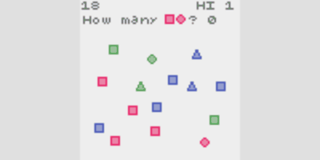
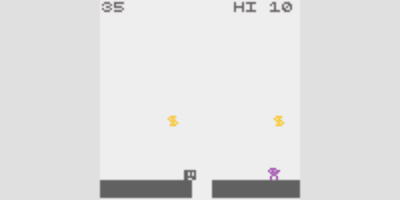

# crisp-game-lib

Develop one game within one hour.

## Demo

[tarutobi](https://abagames.github.io/crisp-game-lib/?tarutobi)

[gloop](https://abagames.github.io/crisp-game-lib/?gloop)

[doshin](https://abagames.github.io/crisp-game-lib/?doshin)

[count](https://abagames.github.io/crisp-game-lib/?count)

[monjum](https://abagames.github.io/crisp-game-lib/?monjum)

