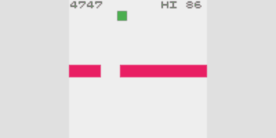
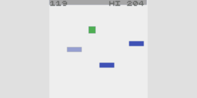

# crisp-game-lib

Develop one game within one hour.

## Demo

[](https://abagames.github.io/crisp-game-lib/?tarutobi)
[](https://abagames.github.io/crisp-game-lib/?gloop)
[](https://abagames.github.io/crisp-game-lib/?doshin)
[](https://abagames.github.io/crisp-game-lib/?count)
[](https://abagames.github.io/crisp-game-lib/?monjum)
[](https://abagames.github.io/crisp-game-lib/?interspace)
[](https://abagames.github.io/crisp-game-lib/?cywall)
[](https://abagames.github.io/crisp-game-lib/?floater)
[](https://abagames.github.io/crisp-game-lib/?pileup)

## Reference

### Drawing ([DEMO](https://abagames.github.io/crisp-game-lib/?ref_drawing))

[](https://abagames.github.io/crisp-game-lib/?ref_drawing)

```javascript
function update() {
  // Set the drawing color.
  // color(colorName : "transparent" | "white" | "red" | "green"  "yellow" | "blue" |
  // "purple" | "cyan" | "black" | "light_red" | "light_green" | "light_yellow" |
  // | "light_blue" | "light_purple" | "light_cyan" | "light_black");
  color("red");
  // Draw the box.
  // box(x, y, width, height);
  // box(pos, size);
  box(20, 20, 15, 20);
  // Draw the rectangle.
  // rect(x, y, width, height);
  // rect(pos, size);
  rect(70, 20, 20, 25);
  // Draw the bar.
  // bar(x, y, length, thickness, rotate, centerPosRatio?);
  // bar(pos, length, thickness, rotate, centerPosRatio?);
  bar(20, 70, 18, 5, 0.7, 0.5);
  // Draw the line.
  // line(x1, y1, x2, y2, thickness);
  // line(p1, p2, thickness);
  line(70, 70, 90, 80);
}
```

### Collision ([DEMO](https://abagames.github.io/crisp-game-lib/?ref_collision))

[](https://abagames.github.io/crisp-game-lib/?ref_collision)

```javascript
function update() {
  color("purple");
  box(50, 50, 20, 10);
  color("green");
  // Check if the drawn figure collides a rect/text/char.
  // [Drawing function].isColliding => {
  //   rect.[color]: boolean;
  //   text.[char]: boolean;
  //   char.[char]: boolean;
  // }
  // If the drawing box collides the purple rect...
  if (box(input.pos, 5, 5).isColliding.rect.purple) {
    end();
  }
}
```

### Input ([DEMO](https://abagames.github.io/crisp-game-lib/?ref_input))

```javascript
function update() {
  // 'input' variable returns the input status.
  // input => {
  //   pos: Vector;
  //   isPressed: boolean;
  //   isJustPressed: boolean;
  //   isJustReleased: boolean;
  // }
  color(input.isPressed ? "red" : "blue");
  box(input.pos, 10, 10);
}
```

### Sound ([DEMO](https://abagames.github.io/crisp-game-lib/?ref_sound))

```javascript
function update() {
  // Plays a sound effect.
  // play(type: "coin" | "laser" | "explosion" | "powerUp" |
  // "hit" | "jump" | "select" | "lucky");
  play("coin");
}
```

### Options

```javascript
// Title of the game.
title = "TARUTOBI";

// Description is shown on a title screen.
description = `
[Slide] Move
`;

// Define pixel arts of characters.
// Characters are assigned from 'a'.
// 'char("a", 0, 0);' shows the character
// defined by the first element of the array.
characters = [
  `
llllll
ll l l
ll l l
llllll
 l  l
 l  l
  `,
  `
llllll
ll l l
ll l l
llllll
ll  ll
  `,
  `
  ll
 llll
l    l
l    l
 l  l
  ll
  `
];

// Set the options.
// options = {
//   isPlayingBgm?: boolean; // Play a BGM.
//   isCapturing?: boolean; // Capture a screen by pressing 'c'.
//   isShowingScore?: boolean; // Show a score and a hi-score.
//   viewSize?: { x: number; y: number }; // Set the screen size.
//   seed?: number; // Set the random seed for sounds.
// }
options = {
  viewSize: { x: 120, y: 60 },
  isPlayingBgm: true
};
```
